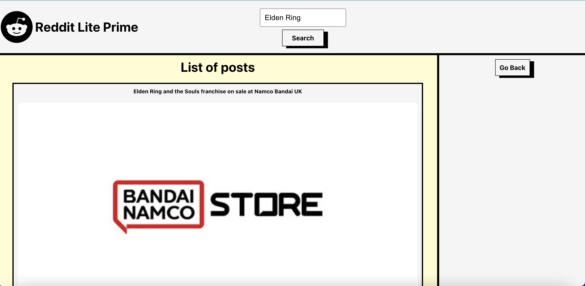
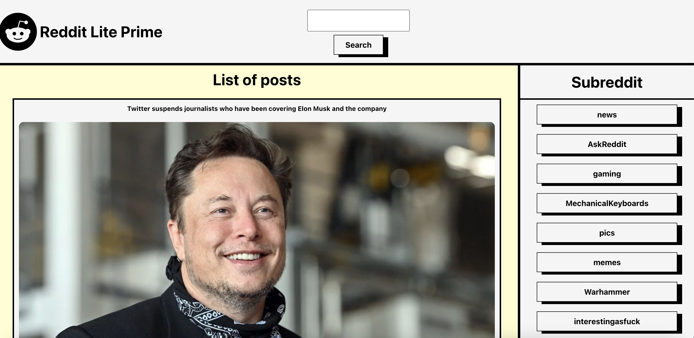
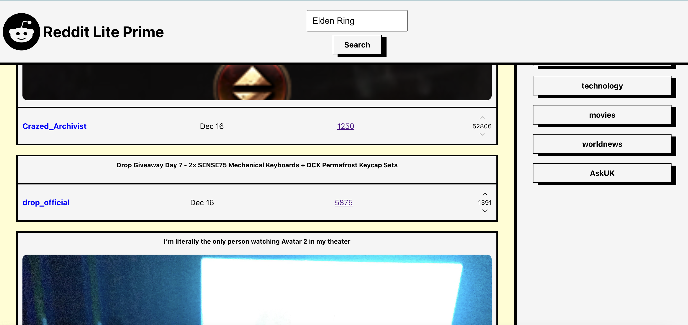
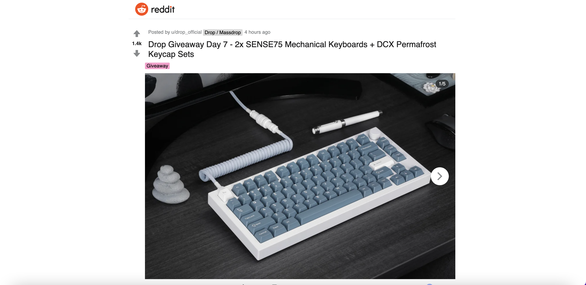

# Reddit-Lite
This application was made for those who wanted to view Reddit-Post. Query different topics and view them in a dashboard while having the ability to comment on them.

## Features
* Query Different Reddit Post
* Search Reddit Post By The Current Popular Trends
* Interact With Them In Various Ways

### Query Different Reddit Post

### Search Reddit Post By The Current Popular Trends

### Interact With Them In Various Ways

## Installation
* Form and clone this repository
* Install NPM packages by running npm install
* Run npm start to open the application in your browser

## Technologies Used 

Utilized a MERN stack to build app
* React.js
* Redux

Other Technologies Used
* Axios
* Netlify

## Planning Process
* Created a wireframe before styling components
* Created new feature branches for each stage of development

# Stay Connected
I am Reginald Jean Amedee, a full-stack software engineer and web developer. Thank you for checking out my work. You can reach out to me at @jeantechnical1992@gmail.com or you can follow me on [Linkedin](https://www.linkedin.com/in/reginaldamedee/)
